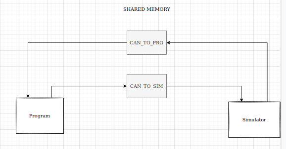

# virtual-embedded-machine
Bu uygulama gömülü yazılımlarda iletişim arayüzlerini kullanmadan onu taklit ederek programı test etmeyi amaçlamaktadır. 
Program içerisine test edeceğimiz programı entegre edeceğiz. 
Simulator ile veri gönderip alacağız. Bir CANBUS protokolünü taklid eder gibi çalışacak. 

Bu haberleşme arayüzünü taklit ederken Shared Memory teknolojisi kullanılmıştır.  

# Program 

Test edilecek program bunun içerisine import edilmelidir. 

# Simulator
Driver kullanımını simule edebilmek için ve veri gönderip alabileceğiniz uygulama.

